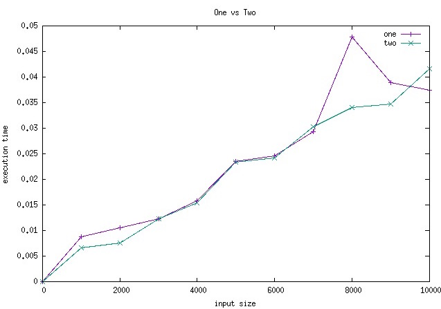
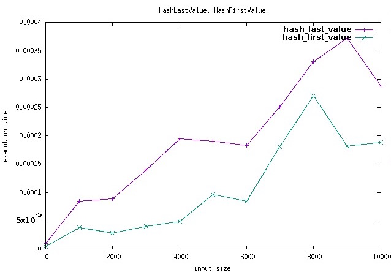

# Graph::Function

When I work on katas and exercises I found I often wanted to compare my implementations. After doing so a half dozen times I noticed some patterns, and figured it'd be valuable to capture those into an easier API to work with.

## Disclaimer

Because of the current implementation details: Ruby methods which operate on `self` **will not work**, and there is a negligible constant slow down on all functions tested because of use of `send(:func)`. The latter won't corrupt comparisons, but means you don't want to use this to benchmark functions individually except through `Graph::Function::Only`.

## Installation

Because this gem depends on `gnuplot` and `xquartz`, we need to follow their [prereq steps](https://github.com/rdp/ruby_gnuplot#pre-requisites-and-installation):

```
# these will vary by your system, mine is mac
brew install Caskroom/cask/xquartz
brew install gnuplot --with-x11
# verify you have x11
xpdyinfo | grep version
```

Now we're set. Add this line to your application's Gemfile:

```ruby
gem 'graph-function'
```

And then execute:

    $ bundle

Or install it yourself as:

    $ gem install graph-function

## Usage

To set up, you only need the following:

```ruby
require 'graph/function'
Graph::Function.configure
```

If you don't want to output to x11, just set `config.terminal` to a different option like `jpg`. Output is the file location of output, and is ignored for x11.

```ruby
Graph::Function.configure do |config|
  config.terminal = 'jpg'
	config.output = File.expand_path('../your_graph_name.jpg', __FILE__)
end
```

For most use cases, you'll be creating a `Graph::Function::Comparison` and executing `#of` on it to provide it with `Method` objects that operate on the same parameter types<sup id="a1">[1](#f1)</sup>. `Comparison` and `Only` take a generator when initialized, but because `IntsComparison` does not, `.of` is a class method instead.

The simplest usage (suitable for a large class of exercises, in my experience) is if you're comparing two functions that take a single argument of `Array[Int]` type:

```ruby
c = YourClass.new # this class has #function_name_one & #function_name_two
Graph::Function::IntsComparison.of(c.method(:function_name_one), c.method(:function_name_two))
# => will output an xquartz graph
```



If your functions need to operate on other types, then you need to generate values of those types. For this, I use [Rantly](https://github.com/hayeah/rantly). Here's an example of comparing two functions that take `Hash{String => Integer}`:

```ruby
generator = proc {|size| Rantly { dict(size) { [string, integer] } }
dict_comparison = Graph::Function::Comparison.new(generator)
# CustomComparison can take any number of Methods
dict_comparison.of(method(:hash_func_one), method(:hash_func_two))
# => will output an xquartz graph
```



If you want to make use of more "real" fake data, [Faker](https://github.com/stympy/faker) is included, and can be used like so:

```ruby
faker_generator = proc {|size| Rantly(size) { call(Proc.new { Faker::Date.backward(14) }) }
# using Only here, but anything that takes a generator can take one with Faker
graph = Graph::Function::Only.new(faker_generator)
graph.of(method(:custom_types))
# => will output an xquartz graph
```

The only downside here is that you can't parameterize `Faker`, but you could use random generators to mix it up. Using the above example, `graph-function` won't pass anything into the `faker_generator` but the `size`, so if we want the value to change, we could use `Faker::Date.backward(proc { rand(10) }.call)`.

Check out the [spec file](spec/graph/function_spec.rb) to see all of these and more examples.

## Development

After checking out the repo, run `bin/setup` to install dependencies. Then, run `rake spec` to run the tests. You can also run `bin/console` for an interactive prompt that will allow you to experiment.

To install this gem onto your local machine, run `bundle exec rake install`. To release a new version, update the version number in `version.rb`, and then run `bundle exec rake release`, which will create a git tag for the version, push git commits and tags, and push the `.gem` file to [rubygems.org](https://rubygems.org).

## Contributing

Bug reports and pull requests are welcome on GitHub at https://github.com/mooreniemi/graph-function. This project is intended to be a safe, welcoming space for collaboration, and contributors are expected to adhere to the [Contributor Covenant](http://contributor-covenant.org) code of conduct.


## License

The gem is available as open source under the terms of the [MIT License](http://opensource.org/licenses/MIT).

## Footnotes

<b id="f1">1</b> Why are we constrained to testing the same parameter types? The intent of this library is to graph _implementations_. Changing parameter types suggests a change in the _behavior_ of the function. That doesn't make for a very productive comparison. [↩](#a1)
